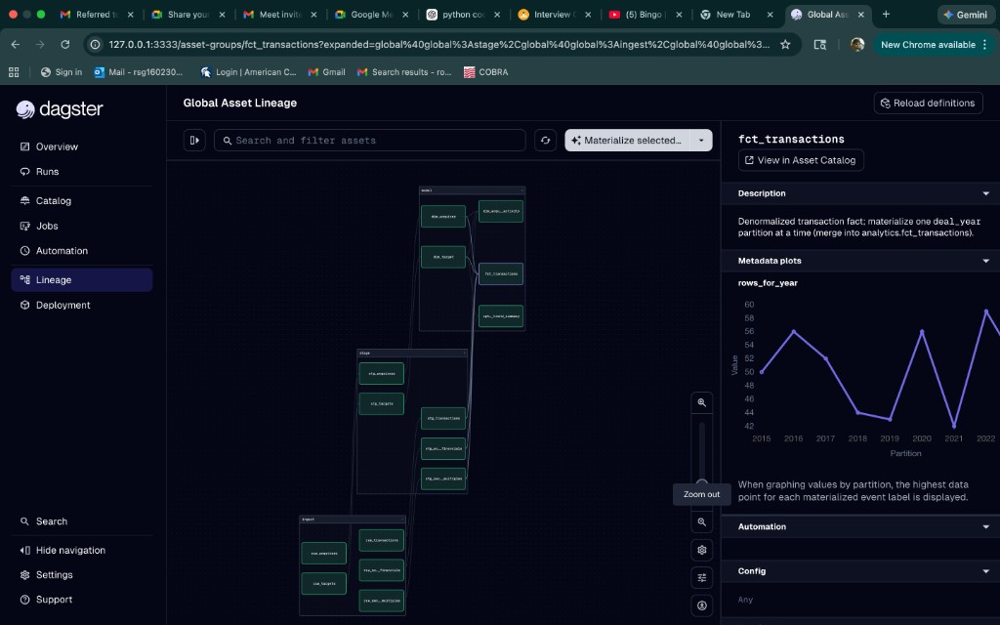

# William Blair DE take-home (Dagster + DuckDB)

Runnable Dagster OSS project: **ingest → stage → model** for the five M&A CSVs, with **asset checks**, **`deal_year` partitions** on `fct_transactions`, a **sensor** on `./data` CSV mtimes, and **environment-based** DuckDB path configuration.

## Dagster UI (Global Asset Lineage)

After `dagster dev` and materializing assets, open **Lineage** in the left nav to see the **ingest → stage → model** graph. The screenshot below shows **`fct_transactions`** selected (partitioned by `deal_year`); the metadata plot is **`rows_for_year`** by partition year.



---

## How to run this pipeline (evaluators — follow in order)

**Goal:** After these steps you will have a local **Dagster UI**, a populated **`warehouse.duckdb`** under the repo root (unless you override paths), and all modeled tables materialized. **`dagster dev` alone does not load data**; you must **materialize assets** once (UI or CLI below).

### 0) Prerequisites

| Requirement | Notes |
|---------------|--------|
| **Python** | **3.10 or newer** (see `requires-python` in `pyproject.toml`). |
| **Git** | Clone or unzip the submission so you have this folder on disk. |
| **Shell** | macOS/Linux: `bash` or `zsh`. Windows: **PowerShell** or **Git Bash** (commands below include a PowerShell variant where it differs). |
| **Network** | Only for `pip install` (first time). The pipeline itself runs **offline** after install. |

### 1) Go to the project root

All commands assume your current directory is the folder that contains **`pyproject.toml`** (this README, `william_blair_de/`, `data/`, etc.).

```bash
cd path/to/William_Blair_DE_test
```

If `ls pyproject.toml` (or `dir pyproject.toml` on Windows) does not show the file, you are in the wrong directory.

### 2) Confirm source CSVs exist

The pipeline reads **five** files from **`./data/`** (relative to the project root):

- `data/acquirers.csv`
- `data/acquirer_financials.csv`
- `data/targets.csv`
- `data/transactions.csv`
- `data/sector_multiples.csv`

If any are missing, ingestion will fail. To use a different folder, set **`WB_DATA_DIR`** to an absolute or relative path before running Dagster.

### 3) Create a virtual environment and install the package

**macOS / Linux:**

```bash
python3 -m venv .venv
source .venv/bin/activate
python -m pip install -U pip
pip install -e .
```

**Windows (PowerShell):**

```powershell
py -3 -m venv .venv
.\.venv\Scripts\Activate.ps1
python -m pip install -U pip
pip install -e .
```

If `py` is not installed, use `python -m venv .venv` instead, ensuring **`python --version`** is at least **3.10**.

You should see `Successfully installed` (or similar) with **`william-blair-de`** editable. **`dagster`** and **`dagster-webserver`** are pulled in as dependencies.

### 4) Set `DAGSTER_HOME` (strongly recommended)

Dagster stores run history in SQLite under **`DAGSTER_HOME`**. If it is **unset**, the CLI may use a **different** storage location than `dagster dev`, so runs started in a terminal might not appear next to UI runs.

**macOS / Linux** (same terminal session for both UI and CLI):

```bash
export DAGSTER_HOME="$HOME/.dagster"
mkdir -p "$DAGSTER_HOME"
```

**Windows (PowerShell):**

```powershell
$env:DAGSTER_HOME = "$env:USERPROFILE\.dagster"
New-Item -ItemType Directory -Force -Path $env:DAGSTER_HOME | Out-Null
```

Optional: add a `dagster.yaml` inside `DAGSTER_HOME` to disable telemetry ([Dagster docs](https://docs.dagster.io/deployment/dagster-instance)).

### 5) Start the Dagster web UI

With the **venv activated** and **`DAGSTER_HOME` set** (step 4), from the **project root**:

```bash
dagster dev
```

- Wait until the log shows a **local URL** (typically **`http://127.0.0.1:3000`**).
- Open that URL in a browser. You should see the **Definitions** / **Assets** UI for code location **`william_blair_de`** (configured in `pyproject.toml` under `[tool.dagster]`).
- Leave this terminal running while you materialize (next step). **Do not start a second `dagster dev`** against the same DuckDB file.

**If `dagster dev` fails with an import error:** ensure `pip install -e .` was run **inside** the activated venv and your shell’s `which dagster` / `Get-Command dagster` points at `.venv`.

---

### 6) Load the warehouse (materialize assets)

You must complete **both** parts: **(A) core assets** and **(B) every `fct_transactions` partition**. Skipping partitions leaves **`analytics.fct_transactions`** empty or partial.

#### Method A — CLI (recommended; copy-paste)

Open a **second** terminal, **activate the same venv**, **`cd` to the project root**, and set **`DAGSTER_HOME` the same way as in step 4**.

**Core path (raw → staging → dimensions → reports → `fct_target_deal_sequence`):**

```bash
dagster asset materialize -m william_blair_de.definitions --select "raw_acquirers,raw_targets,raw_transactions,raw_acquirer_financials,raw_sector_multiples,stg_acquirers,stg_targets,stg_transactions,stg_acquirer_financials,stg_sector_multiples,dim_acquirer,dim_target,dim_acquirer_activity,rpt_sector_trend_summary,fct_target_deal_sequence"
```

**Partitioned fact `fct_transactions` (one run per year; required):**

**macOS / Linux / Git Bash:**

```bash
for y in 2015 2016 2017 2018 2019 2020 2021 2022 2023 2024; do
  dagster asset materialize -m william_blair_de.definitions --select fct_transactions --partition "$y"
done
```

**Windows PowerShell:**

```powershell
foreach ($y in 2015..2024) {
  dagster asset materialize -m william_blair_de.definitions --select fct_transactions --partition $y
}
```

Each command should end with **`RUN_SUCCESS`**. If you see errors about **partitions**, ensure you passed **`--partition`** with a single year for `fct_transactions`.

#### Method B — Dagster UI only

1. In the UI, open **Assets**.
2. Materialize the **ingest** and **stage** assets first (all `raw_*` and `stg_*` assets), then **`dim_acquirer`**, **`dim_target`**, **`dim_acquirer_activity`**, **`rpt_sector_trend_summary`**, **`fct_target_deal_sequence`** (dependencies will run when you use **Materialize all** on a subgraph, or materialize upstream first).
3. For **`fct_transactions`**: open the asset, use **Materialize** with **partitions** — select **all partitions** (`2015`–`2024`) or materialize **each year** in turn. **A non-partitioned materialize of `fct_transactions` is not valid** for this project.

---

### 7) Verify the run succeeded

From the **project root** with venv activated:

```bash
python -c "import duckdb; c=duckdb.connect('warehouse.duckdb', read_only=True); print('fct_transactions', c.execute('select count(*) from analytics.fct_transactions').fetchone()[0])"
```

You should see **`fct_transactions` 500** (or the full row count for your bundled CSVs). If the file is missing, materialization did not complete or the warehouse path was overridden (see environment table below).

---

### Troubleshooting (if something fails)

| Symptom | What to do |
|---------|----------------|
| **`No module named william_blair_de`** | Run `pip install -e .` from the project root with venv **activated**. |
| **`unable to open database file`** (Dagster / SQLite) | Set **`DAGSTER_HOME`** to a directory your user can write (step 4); create the directory first. |
| **Ingest fails / file not found** | Confirm the five CSVs under **`data/`** (step 2) or set **`WB_DATA_DIR`**. |
| **`fct_transactions` errors / empty table** | Run **all ten** partition years **2015–2024** (step 6B). |
| **Only one terminal / no CLI** | Use **Method B** in the UI; ensure partitions for `fct_transactions` are all built. |
| **Fresh start** | `python scripts/reset_warehouse.py` then repeat step 6 (same shell env as Dagster for warehouse path overrides). |

---

### Environment: warehouse path (optional)

Default warehouse file: **`./warehouse.duckdb`** (created on first materialization). Overrides use the same rules for Dagster and for **`scripts/reset_warehouse.py`** / **`scripts/export_sample_outputs.py`**.

| Variable | Role |
|----------|------|
| `WB_WAREHOUSE_PROFILE` | `local` (default) or `prod` / `production` — selects which path rules apply. |
| `WB_LOCAL_DUCKDB_PATH` | Local dev file when profile is local (overrides default `./warehouse.duckdb`). |
| `WB_PROD_DUCKDB_PATH` | Prod-style file when profile is prod (default if unset: `./warehouse_prod.duckdb`). |
| `WB_DUCKDB_PATH` | Legacy override: used for either profile if the profile-specific path is not set. |
| `WB_DUCKDB_READ_ONLY` | If `1` / `true` / `yes` / `on` and profile is prod, opens DuckDB read-only (safer demos). |

**Reset warehouse (drop all loaded schemas):** `python scripts/reset_warehouse.py` — then materialize again from raw. Uses the same resolution as the resource (respect `WB_WAREHOUSE_PROFILE` so you reset the warehouse you are actually using).

---

## Quick reference (same commands, compact)

```bash
cd William_Blair_DE_test
python3 -m venv .venv && source .venv/bin/activate   # Windows: .\.venv\Scripts\Activate.ps1
pip install -e .
export DAGSTER_HOME="$HOME/.dagster" && mkdir -p "$DAGSTER_HOME"
dagster dev
# Second terminal, same venv + DAGSTER_HOME + cd:
dagster asset materialize -m william_blair_de.definitions --select "raw_acquirers,raw_targets,raw_transactions,raw_acquirer_financials,raw_sector_multiples,stg_acquirers,stg_targets,stg_transactions,stg_acquirer_financials,stg_sector_multiples,dim_acquirer,dim_target,dim_acquirer_activity,rpt_sector_trend_summary,fct_target_deal_sequence"
for y in 2015 2016 2017 2018 2019 2020 2021 2022 2023 2024; do dagster asset materialize -m william_blair_de.definitions --select fct_transactions --partition "$y"; done
```

## Sample output data (for reviewers)

The folder **`sample_output_data/`** holds **CSV snapshots** of the three **modeled `analytics` tables** so interviewers can inspect results **without** opening DuckDB first:

| File | DuckDB source | Role |
|------|----------------|------|
| `fct_transactions.csv` | `analytics.fct_transactions` | Denormalized **fact** table (transactions + target + acquirer + benchmarks). |
| `dim_acquirer_activity.csv` | `analytics.dim_acquirer_activity` | **Acquirer-level** summary (deal counts, volumes, sectors, dates). |
| `rpt_sector_trend_summary.csv` | `analytics.rpt_sector_trend_summary` | **Sector × year** activity rollup. |

**How to view**

- **Spreadsheet:** Open any `.csv` in Excel, Google Sheets, or Apple Numbers (UTF-8, comma-separated, header row).
- **CLI:** `head -5 sample_output_data/fct_transactions.csv`
- **DuckDB (read-only on the CSV):**  
  `duckdb -c "SELECT * FROM read_csv_auto('sample_output_data/fct_transactions.csv') LIMIT 10"`
- **Python:**  
  `import pandas as pd; pd.read_csv("sample_output_data/fct_transactions.csv").head()`

**Regenerate after you change model SQL or data**

1. Materialize all assets (see **How to run this pipeline** — step 6 — so every `deal_year` partition of `fct_transactions` is built).
2. Run:

```bash
python scripts/export_sample_outputs.py
```

That reads the **resolved** warehouse path (same env as Dagster) and overwrites the CSVs in `sample_output_data/`. The DuckDB file itself stays **gitignored**; these CSVs are **committed** so the repo carries a static preview aligned with the submission instructions (“sample output or materialized data you want us to see”).

## Why DuckDB (and not Delta for this repo)

**DuckDB** is an **embedded analytical database**: a library you link from Python, storing tables in a **single file** (or in memory). You run **SQL** locally with no database server, which matches the take-home constraint (“no Postgres / Snowflake”). It is strong for **joining staged CSV-derived tables**, **aggregations**, and **ad hoc QA** with minimal setup.

**Delta Lake** is a **table format** (Parquet + transaction log) with **ACID writes, time travel, and scalable incremental** processing. It is a good fit when many writers/readers hit object storage (e.g. S3) or Spark/Databricks is in play. For this assessment, Delta adds **dependencies and I/O patterns** (`deltalake` / Spark) that are not required to demonstrate Dagster; **DuckDB keeps the stack small** and avoids file-lock issues with multiple writers unless you add a careful pattern.

**Verdict:** You *can* use Delta for stage/gold (e.g. `deltalake.write_deltalake` per asset) entirely locally; it is valid but **heavier** than DuckDB for a 4–5 hour exercise. This project uses **DuckDB schemas** `raw`, `staging`, and `analytics` inside one file for clarity.

## Architecture

| Layer    | Dagster `group_name` | DuckDB schema   | Notes |
|----------|----------------------|-----------------|--------|
| Ingest   | `ingest`             | `raw`           | `read_csv_auto(..., all_varchar=true)` — preserve source strings. |
| Stage    | `stage`              | `staging`       | Casts, trims, quarantine table for bad transaction rows. |
| Model    | `model`              | `analytics`     | **SCD1:** `dim_acquirer`, `dim_target`, `dim_acquirer_activity` (merge/upsert on business keys). **Facts / reports:** `fct_transactions` (partitioned by `deal_year`), `fct_target_deal_sequence` (per-target timeline + lag deltas), `rpt_sector_trend_summary` (full refresh). |

**`data_date` (load date) on model tables:** Every table in `analytics` includes a **`data_date`** column (`DATE`). It is set at materialization time from the Dagster run: **run start time in UTC** (from `RunRecord.start_time` when present), else **run creation time**, else **today’s local date** for ad-hoc runs. This gives you a **per-run stamp** for scheduled daily jobs (e.g. `daily_core_ct`) without hard-coding a schedule. See `william_blair_de/materialization_context.py`.

**Executor:** `Definitions(executor=in_process_executor)` so **one process** holds the DuckDB file lock (default multiprocess executor conflicts with a single-writer DuckDB file).

**Partitions:** `fct_transactions` uses `StaticPartitionsDefinition` on calendar years 2015–2024. Each run **deletes then inserts** rows for that year into `analytics.fct_transactions` so you can refresh one year without rebuilding others.

**Sensor:** `data_files_changed_sensor` compares each CSV’s **mtime** (last modified time on disk) under `./data`. When any of those mtimes **change** (file replaced, saved, or copied in), the sensor infers “new data” and can request refresh runs (core assets + one run per `deal_year` for `fct_transactions`). It ships **`STOPPED` by default** — enable under **Overview → Sensors** when demoing.

**Schedule:** `daily_core_ct` runs job **`daily_core_refresh`** at **03:00 America/Chicago** (`0 3 * * *`). It materializes **ingest → stage →** `dim_acquirer`, `dim_target`, `dim_acquirer_activity`, `rpt_sector_trend_summary`, and `fct_target_deal_sequence` (not **`fct_transactions`**, which needs partition keys—materialize that from the UI or CLI backfill). The schedule is **`STOPPED` by default**; turn it on under **Overview → Schedules** for walkthroughs so interviewers see a cron definition without surprise overnight runs on a fresh clone.

## Data quality (high level)

- **Staging quarantine:** `staging.transactions_quarantine` captures rows with missing `transaction_id` or negative `deal_size_mm`.
- **Asset checks:** uniqueness on dimension IDs, FK presence from `stg_transactions` to acquirers/targets, date ordering `close_date >= announce_date`, and **business-rule DQ**: `Closed` outcome requires `close_date`; if both `announce_date` and `close_date` are set, `days_to_close` must be populated (`william_blair_de/assets/checks.py`). **Blank `close_date` for non-Closed deals** (e.g. Pending) is normal, not an error.
- **Inventory (Excel):** see `DATA_QUALITY.xlsx` (sheets: **DQ inventory**, **Raw ingest fidelity**, **Post-materialization SQL**). Regenerate after edits: `python scripts/build_data_quality_xlsx.py`.
- **Non-negative / sign business checks:** `william_blair_de/assets/business_checks.py` plus column rationale and stakeholder semantic ideas in `BUSINESS_CHECKS.md`.

## Known limitations

- **DuckDB + multiprocess:** do not remove `in_process_executor` unless you switch storage (e.g. per-run temp DBs merged externally, or Delta with proper concurrent-write semantics).
- **`fct_transactions` CLI:** `dagster asset materialize --select "*"` fails because partitions must be supplied; use the loop above or the UI backfill.
- **Acquirer financials join:** matched on `fiscal_year = EXTRACT(YEAR FROM announce_date)`; misaligned fiscal vs calendar years are a known simplification.

## Future enhancements

Ideas for taking this pipeline from a take-home to a **production-style** data platform (not in scope for the current repo):

1. **Operational notifications** — Wire run success/failure, asset check failures, and SLAs to **Slack** or **Microsoft Teams** (Dagster hooks, sensors, or an external event bus) so on-call and stakeholders see issues without opening the UI.
2. **Multi-cloud runtime and storage** — Add first-class paths for **Azure** and **GCP** (e.g. secrets, blob/GCS-staged files, and deployment targets) alongside the current local/embedded pattern, with environment-based config only.
3. **Operator experience** — Improve how non-engineers discover assets: curated **runbooks in the UI**, default graph views, and saved materialization selections for backfills and partition coverage.
4. **Security and access control** — **SSO** (SAML/OIDC) and **MFA** for the orchestration metadata store and any future API, plus role-based access to sensitive assets or resources.
5. **Performance and scale** — Profile heavy SQL, add **incremental** or **merge** strategies where full refreshes are not needed, and validate the **DuckDB → warehouse** path (e.g. MotherDuck, remote files) for larger volumes.
6. **Documentation and enablement** — **Tutorials** and short videos for new analysts (how to rematerialize, read lineage, interpret checks) in addition to the README.
7. **APIs and integrations** — Expose a stable **API** (Dagster’s GraphQL or a thin REST layer) for **third-party** tools: trigger backfills, query last success times, or export run metadata for internal portals.
8. **Mobile and lightweight clients** — A small **read-only** mobile or web client for run status and alert triage (not a full replacement for the Dagster UI on day one).
9. **Backup and recovery** — **Automated** backups of the analytics warehouse and Dagster instance state, with tested **restore** runbooks and optional point-in-time recovery for production data.

## References

- [Dagster OSS](https://github.com/dagster-io/dagster)
- [Dagster quickstart](https://docs.dagster.io/getting-started/quickstart)
- [DuckDB](https://duckdb.org/docs/)
